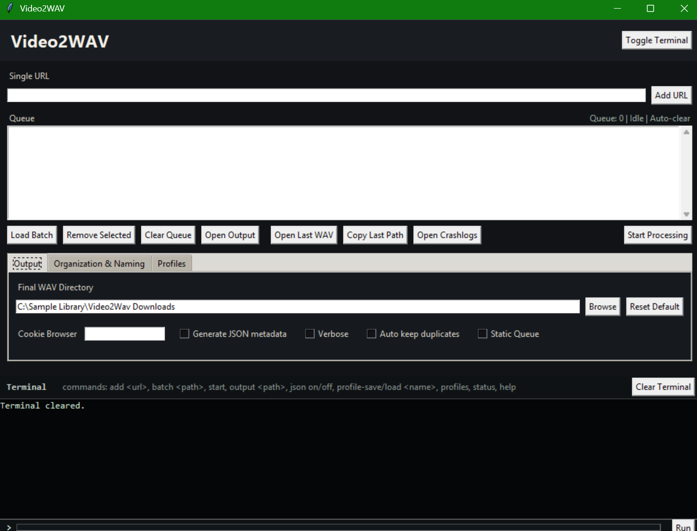
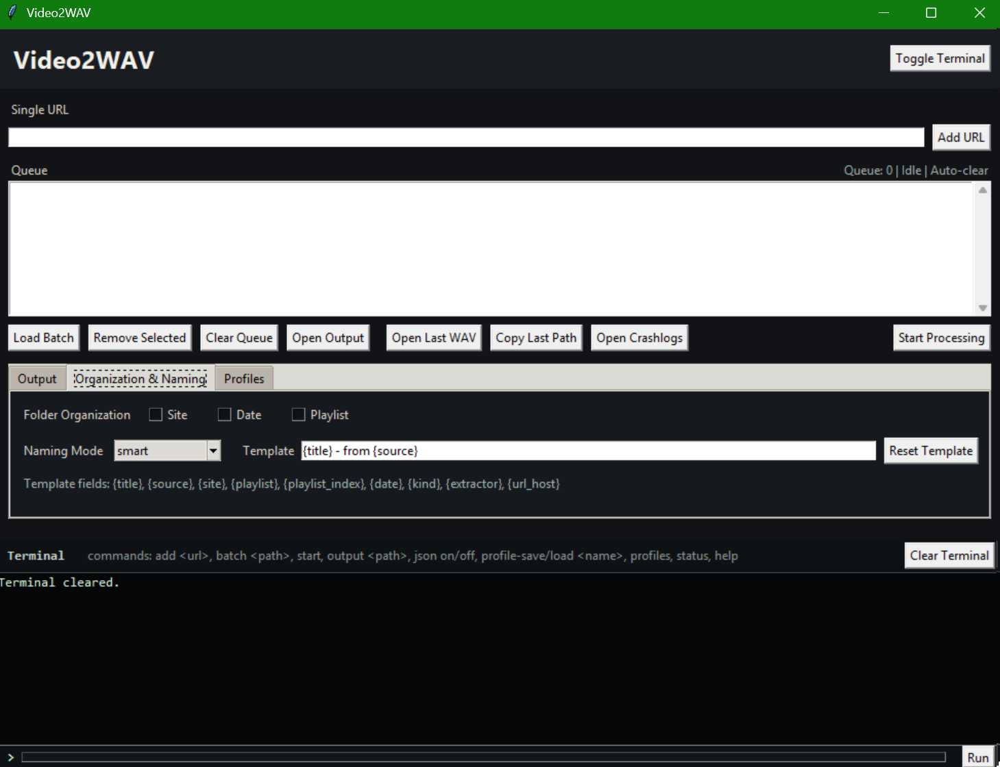
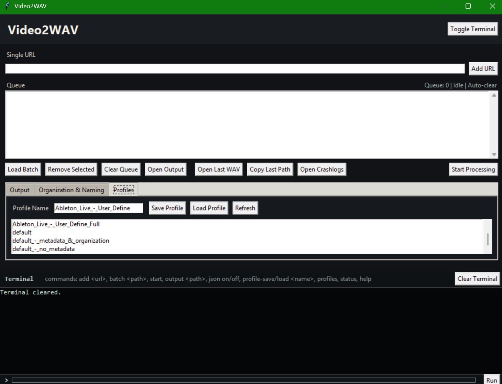
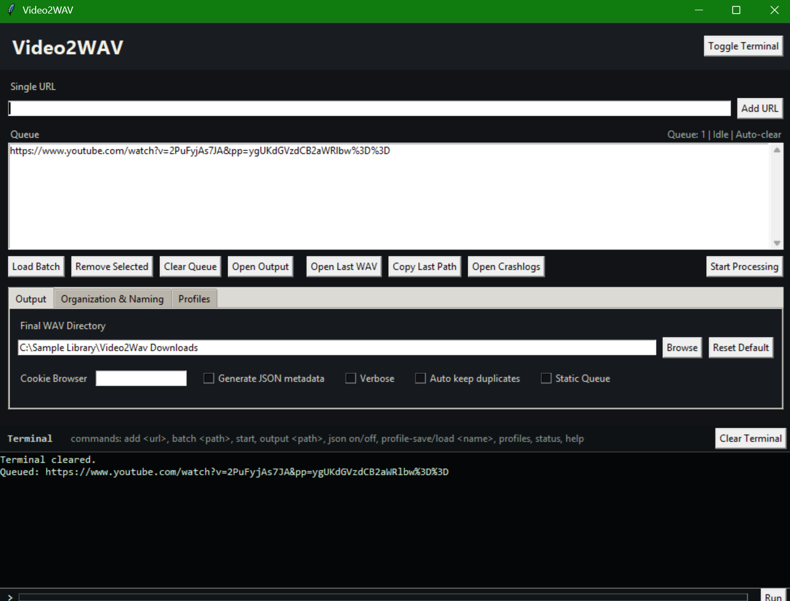
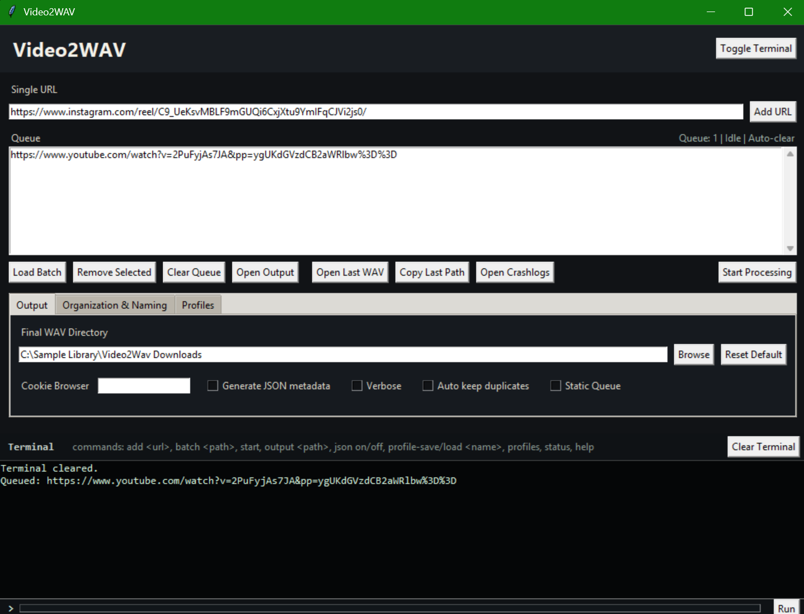
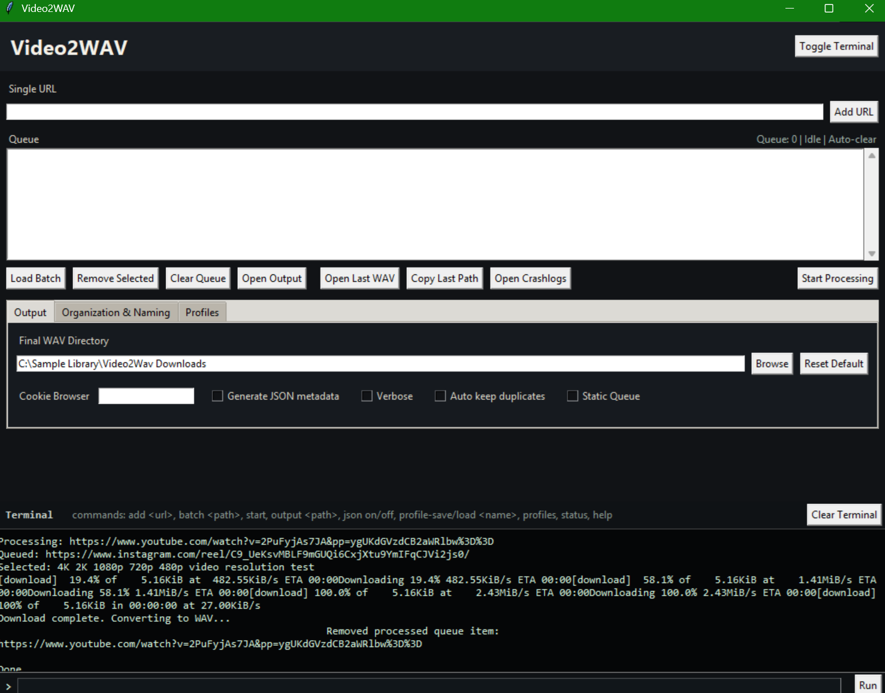
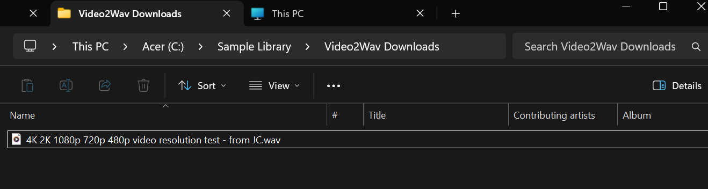

# Video2WAV

## Overview

Extract production-ready WAV audio from direct media URLs, embedded video pages, short-form video URLs, and playlists. Video2WAV supports both a command-line workflow and a Tkinter GUI with queue management, output profiles, custom naming, folder organization, and optional JSON metadata sidecars.

## Previews

A quick look at the Video2WAV interface and workflow. These preview images are loaded from the repository's `imgs/` folder.

<div align="center">
  <table>
    <tr>
      <td align="center" width="50%">
        
      </td>
      <td align="center" width="50%">
        
      </td>
    </tr>
    <tr>
      <td align="center" width="50%">
        
      </td>
      <td align="center" width="50%">
        
      </td>
    </tr>
    <tr>
      <td align="center" width="50%">
        
      </td>
      <td align="center" width="50%">
        
      </td>
    </tr>
    <tr>
      <td align="center" colspan="2">
        
      </td>
    </tr>
  </table>
</div>

## Author

- Jack Cooper

## Project Layout

- `video2wav.py` - primary script or entry point
- `src/settings.py` - output settings, naming templates, organization, and profile persistence
- `README.md` - canonical project documentation
- Legacy readme files, if present, are synchronized to this same content for compatibility with the original folder structure.

## Requirements

- Python 3.9 or newer
- ffmpeg on PATH
- ffprobe on PATH
- Python packages from requirements.txt

## Setup

1. Open a terminal in this project folder.
2. Create and activate a virtual environment when installing third-party packages.
3. Install any packages listed in `requirements.txt` if that file exists, or install the packages named above manually.
4. Confirm external executables such as FFmpeg, FFprobe, ChromeDriver, or model-conversion dependencies are available before running workflows that need them.

## Usage

```bash
python "video2wav.py" --gui
```

Command-line examples:

```bash
python "video2wav.py" "https://example.com/video"
python "video2wav.py" "urls.txt" --no-json --flat-output
python "video2wav.py" "https://example.com/video" --naming-mode template --name-template "{title} - {date}"
python "video2wav.py" "https://example.com/playlist" --playlist-folders --profile production
```

## Outputs

- WAV files under `downloads/<site>/<YYYY-MM-DD>/`.
- Optional JSON metadata sidecars beside each WAV.
- Crash reports under `crashlogs/` if failures occur.
- Reusable GUI/CMD output profiles under `profiles/`.

## Operational Notes

- Run `install_video2wav.bat` to build or refresh the root `Video2WAV.exe` launcher.
- The GUI supports dynamic queue clearing by default and Static Queue mode when processed items should remain visible.
- The GUI `Output` tab controls the final WAV directory, JSON metadata toggle, duplicate behavior, verbosity, and queue mode. `Reset Default` restores the project-local `downloads/` folder.
- The GUI `Organization & Naming` tab controls site/date/playlist folder layers and filename strategies.
- Naming modes are `smart`, `template`, `ask`, and `numbered`. Template fields include `{title}`, `{source}`, `{site}`, `{playlist}`, `{playlist_index}`, `{date}`, `{kind}`, `{extractor}`, and `{url_host}`.
- The GUI `Profiles` tab saves and loads reusable global output settings as JSON files.
- The GUI terminal supports settings commands such as `output <path>`, `output-default`, `json on`, `json off`, `naming template`, `template {title} - from {source}`, `organize site off`, `profile-save production`, and `profile-load production`.
- Use cookies only when needed and only from browser profiles you control.

## Maintenance And Customization

- Keep configuration constants near the top of the source file or in a clearly named settings section.
- Preserve input validation before filesystem, network, model, or process-management work.
- Keep generated output in clearly named folders so source files, installers, and readmes remain easy to identify.
- When adding dependencies, update `requirements.txt` and this README in the same change.
- Prefer small, named helper functions with docstrings over large blocks of inline logic.

## Disclaimer

This project is provided as-is for lawful, user-directed work. Jack Cooper is not liable for misuse, data loss, platform policy violations, third-party account actions, or damage caused by modifying, redistributing, or running this project. Confirm that you have the right to process any input files, URLs, credentials, downloaded content, models, or generated outputs before using the tool.
